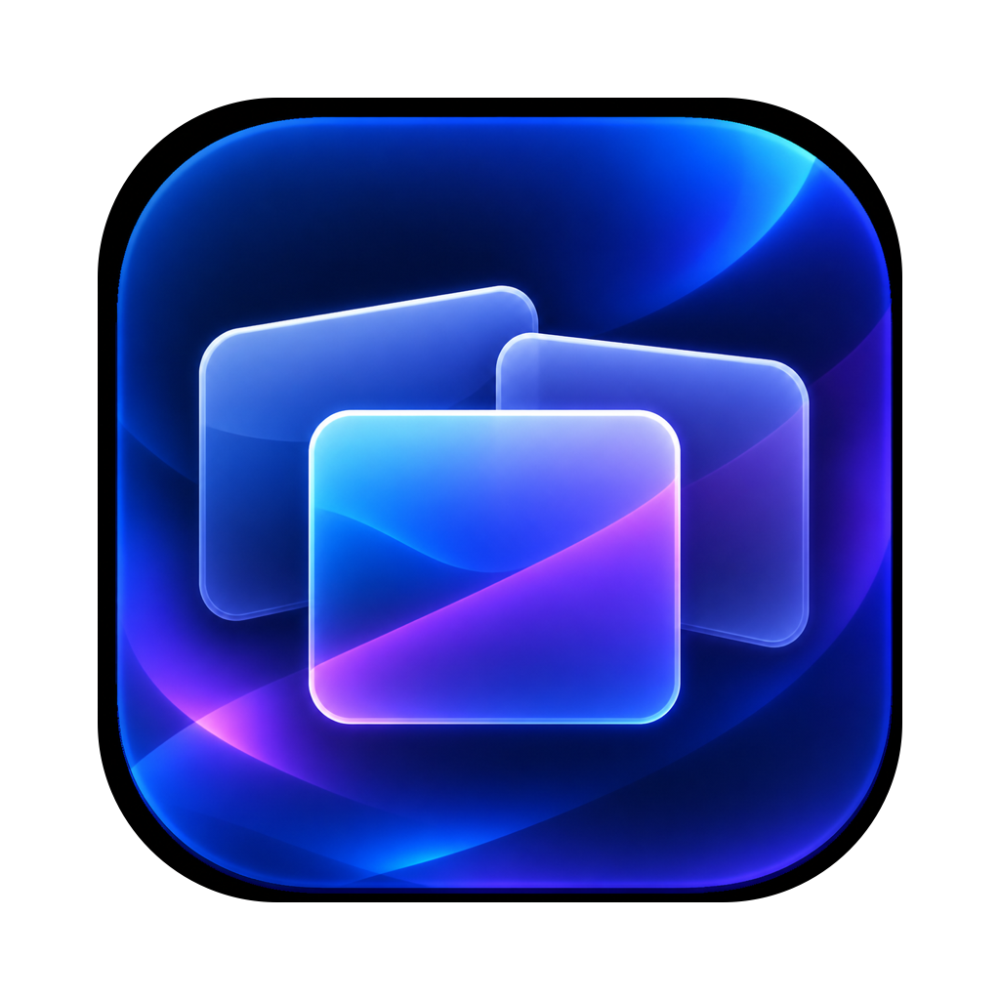

# Better Mission Control



A macOS menu-bar overlay that looks like Mission Control but lets you close,
minimize, quit and rearrange windows directly from the overview.

See [CLAUDE.md](CLAUDE.md) for the full product requirements.

## Build and run

The app icon lives at `Resources/AppIcon.png` — a 1024 master with a
transparent surround and the artwork at Apple's standard 824pt body size.
`./scripts/make-icon.sh` turns it into `Resources/AppIcon.icns`; rerun it after
replacing the master.

First time only, create a local signing identity:

```bash
./scripts/create-signing-identity.sh
```

Then build and run:

```bash
./build.sh run
```

That compiles, assembles `dist/BetterMissionControl.app`, signs it and
launches it. `./build.sh` alone builds without launching; `./build.sh release`
makes an optimised build.

The app has no Dock icon — look for the grid icon in the menu bar.

## First run: two permissions

macOS keeps both switched off until you turn them on by hand. The welcome
window that appears on first launch explains each one and has an **Allow**
button, which is what triggers the system prompt.

| Permission | Why it's needed | Without it |
|---|---|---|
| Screen Recording | Draws each window's thumbnail | Overlay explains what's missing instead of showing tiles |
| Accessibility | Close / minimize / raise other apps' windows | You can look but not act |

**Screen Recording only takes effect after a relaunch** — macOS reads that
consent once, at launch. Quit from the menu bar item and run `./build.sh run`
again after granting it.

You can reopen the explanation any time from the menu bar icon →
**Permissions & Help…**

## Using it

Press **⌃⌥↑** (Control-Option-Up) anywhere to open the overview — configurable
in Settings (⌘,). The default is deliberately one modifier away from Mission
Control's own ⌃↑ so both don't fire at once.

| Action | What it does |
|---|---|
| Click a tile | Activate that window, dismiss the overlay |
| Click the ✕ badge | Close that window, stay in the overlay |
| Arrow keys / Tab | Move the selection |
| Return | Activate the selected window |
| ⌘W | Close the selected window |
| ⌘M | Minimize it (its tile disappears) |
| ⌘Q | Quit the owning app and all its tiles |
| Esc, or click the background | Dismiss with nothing changed |
| Drag a tile | Move it anywhere in the overlay — remembered for next time |
| Middle-click a tile | Close that window |
| Hover a tile | Highlights it and reveals its window controls |

Hovering highlights, the way Mission Control does, so Return always acts on
whatever the pointer is over. Arrow keys still move the highlight — a
stationary pointer sends no hover events to fight back.

Each tile shows four controls on hover or selection, following AltTab's
arrangement — purple first, then the window's own traffic lights:

| | |
|---|---|
| 🟣 Power | Force quit the app — **unsaved work is lost, with no prompt** |
| 🔴 Close | Close that window |
| 🟡 Minimize | Minimize it |
| 🟢 Zoom | Press the window's green button |

⌘Q remains the polite quit: the app runs its normal shutdown and can prompt
about unsaved work. The purple button deliberately does not.

Middle-click closes a window without aiming for the red dot. If you run
something like MiddleClick, a three-finger click becomes a real middle click,
so a three-finger click on a tile closes it — no special support needed.

Tiles aren't constrained to a grid: drag one wherever you want it and that
exact spot is restored next time. Arrow keys pick the nearest tile in the
direction you press, so navigation still works however you've arranged things.

Positions are saved to
`~/Library/Application Support/BetterMissionControl/layout.json`, normalised to
a fraction of the screen so a layout still makes sense on a different display
or after a resolution change. Menu bar icon → **Reset Saved Layout** returns to
the automatic app-grouped arrangement.

## Settings (⌘,)

Open with ⌘, — from inside the overview, from any of the app's windows, or via
the menu bar icon.

### Changing the hotkey

Click the hotkey button and press the combination you want. Esc cancels.
**Reset** puts ⌃⌥↑ back.

Ordinary keys need at least one modifier, since a bare letter would swallow
that keystroke system-wide. Function keys don't — F3 on its own is a valid
hotkey, which is the point if you're taking it back from Mission Control.

If macOS already uses the combination you picked, Settings says which shortcut
it clashes with rather than letting the two fight silently. That check reads
the same preference file System Settings writes
(`com.apple.symbolichotkeys`) — `RegisterEventHotKey` is no use for this, since
it happily succeeds for a combination the system owns and then the system just
wins.

### Four-finger swipe up

Settings has a switch for it. **Off by default**, because it's the one feature
built on a private Apple interface.

macOS never delivers four-finger swipes to other apps — verified, not assumed,
with the `input` probe: no public `NSEvent` route sees them. The only way is to
read trackpad contacts directly through `MultitouchSupport`, which is what
BetterTouchTool and Swish do. That's confined to
[MultitouchBridge.swift](Sources/BetterMissionControl/MultitouchBridge.swift) —
see Notable decisions.

Swipe **up** to open the overview and **down** to dismiss it, mirroring
Mission Control. The two thresholds are deliberately different: the guided
probe measured a swipe up at about +2.07 mean velocity but a swipe down at only
-0.58, so a single symmetric threshold would never catch a downward swipe.

**You must turn Apple's own gesture off** (Trackpad → More Gestures → Mission
Control → Off), or both open at once. That isn't a preference: reading contacts
is passive, so the swipe can be observed but never taken, and macOS acts on it
regardless. Settings says so and links straight to the pane.

### The Dock

While the overview is open the Dock stays visible, then goes back to hiding
itself afterwards.

There's no public API to reveal an auto-hidden Dock, so this turns the Dock's
own auto-hide setting off for the duration and puts it straight back — through
System Events, which the Dock applies live (writing the preference directly
would need the Dock restarted, which flashes the screen). macOS asks once for
Automation permission.

The change is made *last*, once the tiles have finished flying into place.
Revealing the Dock makes macOS reflow windows that were sized around its
absence, and doing it up front put that reflow in plain sight — Dock slides in,
windows jump, then the overview appears. It also moved the very windows the
open animation flies the tiles out of, so they started from stale positions.

The Dock is also put back *before* the chosen window is raised, not after.
macOS lays a window out for the space available at the moment it comes
forward, so raising it while the Dock was still being held open left
full-screen and zoomed windows short by the Dock's height — 92pt on this
display — once the Dock hid again, cutting off the bottom. Restoring first
costs nothing: the setting applies synchronously and `visibleFrame` is back to
full the instant it returns (measured with the `dockframe` self-test).

Revealing the Dock also reflows every full-height window — 4 of 5 open windows
here shrink from 1205 to 1113pt. Tiles are therefore laid out from a
`layoutFrame` frozen when the window first appears, not from its live frame, so
the overview holds still instead of every tile changing shape a second after
opening. The live frame is still what Accessibility matching uses, since that
has to track where the window really is.

Because that's a real system setting, it's restored when the overlay closes,
again when the app quits, and — if the app is ever killed mid-overlay — on the
next launch, from a flag left on disk. If auto-hide was already off, nothing is
touched at all.

The overlay also sits just *below* the Dock's window level, so the Dock draws
over it rather than behind it. One consequence: the menu bar shows over the
overlay too, since the Dock sits at a lower level than the menu bar and no
single level is both above one and below the other. Real Mission Control shows
both as well.

### Apple's Mission Control

A button in the top right closes the overview and opens Apple's own Mission
Control instead. The app keeps running — the next summon behaves normally.
Useful when the F3 key is bound to this app, since that's otherwise the only
way to reach Apple's version.

### The F3 key

Settings has a switch for it. Turn it on and F3 opens this instead of Apple's
Mission Control — nothing in System Settings needs changing, and brightness,
volume and the other function keys keep working exactly as before.

**Unticking "Mission Control" in Keyboard Shortcuts does not free up F3.** That
setting only governs the key *combination* (⌘↑ or ⌃↑); the function-row key is
claimed further down the stack, which is why unticking it changes nothing.

The route was found by measurement. Pressing F3 emits a plain key event with
virtual code 160, and it is visible at a **HID tap** — which sits *before* the
WindowServer. A tap there can swallow the event, so macOS never acts on it. A
session tap, which is where the first attempt looked, sits after the
WindowServer and is too late to stop anything. Needs Accessibility, which the
app already requires; no extra permission and no driver.

## How it's built

| Need | What's used |
|---|---|
| Overlay window | `NSPanel` above the menu bar level, `.canJoinAllSpaces` |
| Window list + thumbnails | ScreenCaptureKit (`SCShareableContent`, `SCScreenshotManager`) |
| Close / minimize / raise | Accessibility API (`AXUIElement`) |
| Quit an app | `NSRunningApplication.terminate()` |
| Global hotkey | Carbon `RegisterEventHotKey` |
| Saved layout | JSON in Application Support |

### Notable decisions

- **SwiftPM, not an Xcode project.** Only the Command Line Tools are installed
  on this machine, so there's no `xcodebuild`. `build.sh` assembles the `.app`
  bundle by hand, which is what macOS requires before it will grant TCC
  permissions to the binary.

- **No `@State` anywhere.** In the macOS 26+ SDK SwiftUI's `@State` is a macro,
  and its compiler plugin (`libSwiftUIMacros.dylib`) ships only with full
  Xcode. Hover state lives on the `@Observable` model instead — `@Observable`
  works because `libObservationMacros.dylib` *is* bundled with the CLT.
  Installing Xcode would lift this constraint.

- **Window matching uses public API only.** ScreenCaptureKit gives a
  `CGWindowID`; the Accessibility API speaks `AXUIElement`, and no *public*
  call bridges them. `_AXUIElementGetWindow` does, but it's private SPI — the
  kind of dependency that got HyperDock broken. Instead `WindowActions` scores
  candidates on owning process, frame and title; both APIs report frames in the
  same coordinate space, so an exact frame match is a strong signal.

- **Thumbnails refresh on a 1s poll**, rather than running a live `SCStream`
  per window. Far cheaper, and the overlay is typically only open for seconds.
  The interval is `refreshInterval` in `OverviewModel`.

- **Captures are sized from the tile's rendered size × the display's backing
  scale factor.** A fixed cap was what made thumbnails look soft: with only a
  few windows open, tiles are drawn large enough that a capped capture had to
  be upscaled. Sizing from the size a tile is actually drawn at keeps it sharp
  at any tile size and captures *less* when tiles are small. A window is never
  drawn beyond its own native size — there'd be no extra detail to show, so
  stretching it would only look blurry.

- **The dimmed backdrop is the real desktop**, captured by filtering out every
  window at or above the normal layer. A plain blur would show the windows
  sitting behind the overlay, which reads quite differently from native Mission
  Control.

- **The System Settings deep links were verified on macOS 27, not assumed.**
  The anchors have shifted between releases, so both were checked by opening
  them and looking at the result:
  `com.apple.Keyboard-Settings.extension?Shortcuts` opens Keyboard with the
  Keyboard Shortcuts sheet up, and
  `com.apple.Trackpad-Settings.extension?MoreGestures` lands directly on the
  More Gestures tab. If an anchor ever stops resolving, the app falls back to
  opening System Settings and the on-screen steps say where to go.

- **One private framework, deliberately, sealed in one file.** The PRD rules
  private APIs out, and that still holds everywhere except the four-finger
  swipe, which has no public route at all. That exception was made knowingly,
  and [MultitouchBridge.swift](Sources/BetterMissionControl/MultitouchBridge.swift)
  is built to fail safe rather than to be trusted: symbols are resolved at
  runtime with `dlopen`/`dlsym` so a renamed one can only make `start()` return
  false — never a crash or a failed launch — no type it declares escapes the
  file, and the feature is opt-in and off by default. If a macOS update breaks
  it, the switch turns itself off and explains why. The fix is to leave it off,
  not to chase Apple's internals.

- **A local self-signed certificate, not ad-hoc.** This one is worth knowing
  about because the symptom is baffling: with an ad-hoc signature every rebuild
  made macOS re-ask for Screen Recording and Accessibility, while both switches
  stayed *on* in System Settings. macOS records the exact code hash when a
  permission is granted, and an ad-hoc signature has no identity beyond that
  hash — so any rebuild looked like a different app and was quietly denied.
  Signing with a certificate makes the recorded requirement
  `identifier "…" and certificate leaf = H"…"`, which is identical across
  builds, so the grants survive. A Developer ID certificate replaces it at
  release time.

  The certificate is self-signed, lives only in your login keychain and is not
  trusted by anything else — `security find-identity -v` won't even list it.
  That's expected: signing doesn't require trust. Remove it with
  `security delete-certificate -c "Better Mission Control Dev"`.

## Not in v1

Per the PRD: multiple Spaces, per-display overlays, and Mac App Store
distribution. Capturing or reassigning F3 and the trackpad gesture is
deliberately out too — Settings guides you through doing it by hand instead.

Release signing (`codesign` with a Developer ID + `notarytool`) isn't wired up
either — it needs an Apple Developer Program membership and full Xcode.

## Testing

There's no Xcode and therefore no test target, so `SelfTest` drives the real
code paths headlessly behind an environment variable:

```bash
BMC_SELFTEST=match dist/BetterMissionControl.app/Contents/MacOS/BetterMissionControl
```

Modes: `list`, `match` (window matching, non-destructive), `close`, `minimize`,
`key` (Cmd-W through the real key handler), `focus` (does the panel take
keyboard focus), `drag` and `persist` (free-form positions), `thumbs` (capture
resolution and tile aspect vs rendered size), `zorder`, `hotkey`, `settings`,
`settingsui`, `gesture` (swipe recognition), `dock`, `dockframe` (screen area vs the Dock), `reflow` (tiles vs window reflow), `input` (guided: what macOS delivers for F3 and four-finger swipes). Set `BMC_SELFTEST_APP` to pick a target app where a mode needs
one.

`screenshot` mode is the useful one for checking appearance — it opens the
overlay, captures it to PNG, drags a tile over another and captures again:

```bash
BMC_SELFTEST=screenshot BMC_SELFTEST_OUT=/tmp dist/BetterMissionControl.app/Contents/MacOS/BetterMissionControl
```
